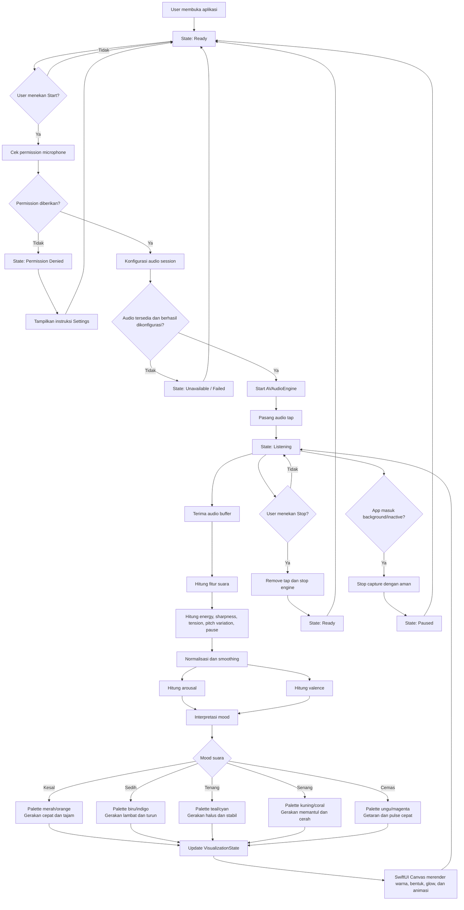

# Audio-to-Emotion Visualizer — Flowcharts & Technology Map

Dokumen ini menjelaskan alur bisnis dan alur antar-object teknologi untuk mengubah karakter suara menjadi mood visual berupa warna, bentuk, glow, dan animasi.

## 1. Flowchart Logic Bisnis



Audio mentah hanya digunakan selama proses analisis. Data yang dikirim ke UI berupa fitur ringkas seperti `energy`, `arousal`, `valence`, dan `mood`.

## 2. Flowchart Object dan Teknologi

```mermaid
flowchart LR
    A[User gesture] --> B[ContentView<br/>SwiftUI]
    B --> C[VoiceVisualizerViewModel<br/>@MainActor]

    C --> D[AudioCaptureService]
    D --> E[AVAudioSession]
    E --> F[iOS Audio Subsystem]
    F --> G[Microphone Hardware]

    D --> H[AVAudioEngine]
    H --> I[Input Node Audio Tap]
    I --> J[AVAudioPCMBuffer]

    J --> K[AudioAnalyzer]
    K --> L[RMS / Energy]
    K --> M[vDSP FFT]
    K --> N[Spectral Features]
    K --> O[Pitch / Variation]
    K --> P[Pause / Silence Detection]

    L --> Q[AudioFeatures]
    M --> Q
    N --> Q
    O --> Q
    P --> Q

    Q --> R[EmotionMapper]
    R --> S[Arousal]
    R --> T[Valence]
    R --> U[Mood Classification]

    S --> V[VisualizationMapper]
    T --> V
    U --> V
    Q --> V

    V --> W[VisualizationState]
    W --> C
    C --> X[SwiftUI Canvas]
    X --> Y[Color]
    X --> Z[Orb / Shape]
    X --> AA[Glow / Gradient]
    X --> AB[Pulse / Ripple / Motion]

    C --> AC[ListeningState]
    AC --> B
```

## 3. Tanggung Jawab Object

| Object / teknologi | Memproses apa | Mengirim ke mana |
|---|---|---|
| `ContentView` | Input Start/Stop dan lifecycle UI | Intent ke `ViewModel` |
| `VoiceVisualizerViewModel` | State aplikasi, error, lifecycle, koordinasi | Perintah ke service dan state ke SwiftUI |
| `AudioCaptureService` | Permission, konfigurasi audio, start/stop engine | `AVAudioPCMBuffer` ke analyzer |
| `AVAudioSession` | Permission dan akses audio input | Status audio ke capture service |
| `AVAudioEngine` | Menangkap audio real-time | Buffer audio melalui input tap |
| `AVAudioPCMBuffer` | Sampel PCM sementara | Diteruskan ke `AudioAnalyzer` |
| `AudioAnalyzer` | RMS, silence, FFT, pitch variation, spectral energy | `AudioFeatures` |
| `Accelerate/vDSP` | Perhitungan FFT dan magnitude spektrum | Data frekuensi ke analyzer |
| `EmotionMapper` | Mengubah fitur suara menjadi arousal, valence, dan mood | `EmotionState` |
| `VisualizationMapper` | Mengubah mood/audio menjadi hue, brightness, scale, glow, motion | `VisualizationState` |
| `VisualizationState` | Data visual siap render | `ViewModel` lalu `ContentView` |
| `SwiftUI Canvas` | Menggambar visual dan animasi | Tampilan akhir di layar |

## 4. Model Data

```swift
struct AudioFeatures: Sendable {
    let energy: Float
    let sharpness: Float
    let tension: Float
    let pitchVariation: Float
    let pauseRatio: Float
    let isSilent: Bool
}
```

```swift
struct EmotionState: Sendable {
    let arousal: Float
    let valence: Float
    let mood: Mood
}
```

```swift
struct VisualizationState: Sendable {
    let hue: Double
    let saturation: Double
    let brightness: Double
    let orbScale: Double
    let glowRadius: Double
    let pulseAmount: Double
    let motionIntensity: Double
}
```

## 5. Ringkasan Alur Teknologi

```text
Microphone
  → AVAudioSession
  → AVAudioEngine
  → AVAudioPCMBuffer
  → AudioAnalyzer
  → AudioFeatures
  → EmotionMapper
  → EmotionState
  → VisualizationMapper
  → VisualizationState
  → SwiftUI Canvas
```

`Canvas` hanya bertugas menggambar. Semua logika audio dan interpretasi emosi berada di luar `View`.
