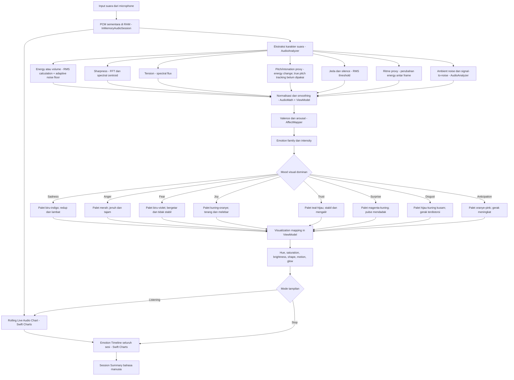
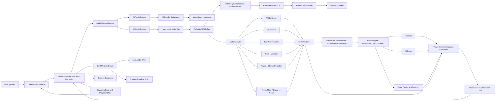

# Audio-to-Emotion Visualizer — Flowcharts & Technology Map

Dokumen ini menjelaskan alur bisnis dan alur antar-object teknologi untuk mengubah karakter suara menjadi mood visual berupa warna, bentuk, glow, dan animasi. Audio mentah hanya ditahan sementara di RAM agar sesi dapat dianalisis dan di-replay secara lokal.

## 1. Flowchart Logic Bisnis



`AudioAnalyzer`, tahap preprocessing, `AffectMapper`, dan visualization mapping adalah logic aplikasi. Saat ini preprocessing dan visualization mapping masih berada di `AudioMath`/`VoiceVisualizerViewModel` agar sederhana; keduanya belum menjadi service terpisah. Tidak ada `EmotionMapper` bawaan iOS. `AffectMapper` merupakan ruleset produk berbasis valence/arousal yang dapat diuji dan dikalibrasi.

## 2. Flowchart Object dan Teknologi



## 3. Tanggung Jawab Object

| Object / teknologi | Memproses apa | Mengirim ke mana |
|---|---|---|
| `ContentView` | Input Start/Stop/Replay/Discard dan lifecycle UI | Intent ke `ViewModel` |
| `VoiceVisualizerViewModel` | State aplikasi, error, lifecycle, koordinasi | Perintah ke service dan state ke SwiftUI |
| `AudioCaptureService` | Permission, konfigurasi audio, start/stop engine | `AVAudioPCMBuffer` ke session store dan analyzer |
| `InMemoryAudioSession` | Menahan PCM chunks sementara dengan batas durasi/memori | Buffer ke replay service; dapat di-clear |
| `AudioReplayService` | Menjadwalkan buffer RAM untuk playback lokal | `AVAudioPlayerNode` dan speaker |
| `AVAudioSession` | Permission dan akses audio input/output | Status audio ke service |
| `AVAudioEngine` | Menangkap audio real-time | Buffer audio melalui input tap |
| `AVAudioPCMBuffer` | Sampel PCM sementara di RAM | Session store dan analyzer |
| `AudioAnalyzer` | RMS, silence, FFT, spectral centroid/flux, pitch variation, noise floor, signal-to-noise | `AudioFeatures` |
| `Accelerate/vDSP` | Windowing, FFT, magnitude, spectral features | Data spektrum ke analyzer |
| `AudioMath` + `VoiceVisualizerViewModel` | Normalisasi, clamping, smoothing, dan peak handling | Fitur stabil ke `AffectMapper` |
| `AffectMapper` | Ruleset berbasis valence/arousal; bukan API bawaan atau detector universal | `AffectState` |
| Visualization mapping di `VoiceVisualizerViewModel` | Mengubah affect/audio menjadi hue, brightness, scale, glow, dan warna chart | `VisualizationState` / chart color |
| `Swift Charts` | Menggambar rolling live chart dan timeline emosi berwarna | Tampilan grafik di layar |
| `Session Summary` | Menghitung rata-rata, peak, mood dominan/sekunder, dan kesimpulan bahasa manusia | Ringkasan sesi setelah Stop |

## 4. Model Data

```swift
struct AudioFeatures: Sendable {
    let energy: Float
    let spectralSharpness: Float
    let spectralFlux: Float
    let pitchVariation: Float
    let pauseRatio: Float
    let speechRhythm: Float
    let isSilent: Bool
}
```

```swift
struct AffectState: Sendable {
    let valence: Float       // negative ... positive
    let arousal: Float       // low energy ... high energy
    let family: EmotionFamily
    let intensity: Float
}
```

```swift
struct VisualizationState: Sendable {
    let hue: Double
    let saturation: Double
    let brightness: Double
    let orbScale: Double
    let glowRadius: Double
    let pulseAmount: Double
    let motionIntensity: Double
}
```

```swift
struct AudioChartPoint: Identifiable, Sendable {
    let id: Int
    let level: Double
    let frequency: Double
}

struct EmotionTimelinePoint: Identifiable, Sendable {
    let id: Int
    let level: Double
    let family: EmotionFamily
}
```

## 5. Kebijakan Audio Sementara dan Replay

```text
Microphone
  → AVAudioSession
  → AVAudioEngine
  → AVAudioPCMBuffer
  ├─→ InMemoryAudioSession (RAM, bounded duration)
  │    → AudioReplayService
  │    → AVAudioPlayerNode
  │    → Speaker
  └─→ AudioAnalyzer
       → AudioFeatures
  → AudioMath + ViewModel preprocessing
       → AffectMapper
       → AffectState
  → Visualization mapping
  → VisualizationState / chart colors
  → Swift Charts
```

Replay harus dipicu eksplisit oleh pengguna. Session buffer memiliki batas durasi atau memory budget; buffer tidak boleh tumbuh tanpa batas. Pengguna dapat menekan Discard untuk menghapus audio dari RAM. Audio tidak ditulis ke file dan tidak dikirim ke server.

## Algoritma paling penting

Bagian paling penting adalah `AffectMapper`, karena di situlah fitur audio diterjemahkan menjadi arti visual dan emosi. FFT hanya membantu membaca karakter frekuensi; ia tidak otomatis mengetahui emosi.

```text
PCM buffer
  → RMS energy
  → adaptive noise floor + signal-to-noise
  → Hann window + vDSP FFT
  → spectral sharpness + spectral flux
  → normalisasi + smoothing
  → valence + arousal
  → emotion family + intensity
  → hue + saturation + chart color
```

Rumus produk saat ini:

```text
arousal = 0.45 × energy
         + 0.22 × speechRhythm
         + 0.20 × spectralFlux
         + 0.13 × sharpness

valence = 0.28
        + 0.22 × pitchVariation
        + 0.12 × energy
        - 0.28 × spectralFlux
        - 0.24 × pauseRatio
```

Nilai tersebut dihaluskan dan dipakai untuk memilih family seperti `Trust`, `Sadness`, `Anger`, `Fear`, `Joy`, dan `Anticipation`. Ini adalah ruleset produk yang dapat diuji dan dikalibrasi, bukan emotion detector bawaan iOS dan bukan klaim membaca perasaan subjektif pengguna.

## Perbedaan chart live dan timeline

```text
Saat Listening:
  AudioFeatures → 72 titik rolling → Live Audio Chart
  Warna chart mengikuti mood saat ini.

Saat Stop:
  Semua frame sesi → maksimal 120 titik tampilan
  Setiap titik memakai warna emotion family-nya sendiri
  → Emotion Timeline + Session Summary
```

Dengan model ini, lonjakan merah/oranye singkat tetap terlihat pada timeline akhir, meskipun mood dominan sesi tetap hijau/Trust.

Semua pemrosesan dilakukan lokal. `Swift Charts` hanya menggambar data ringkas; ia tidak memproses audio mentah.
