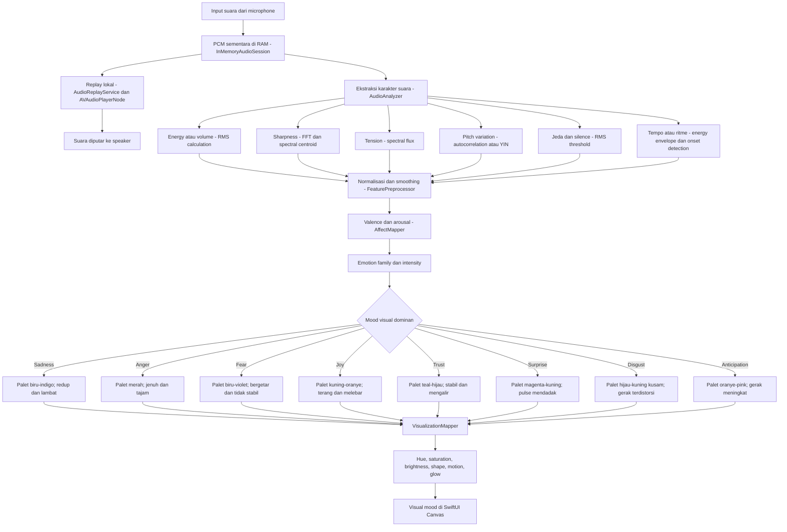
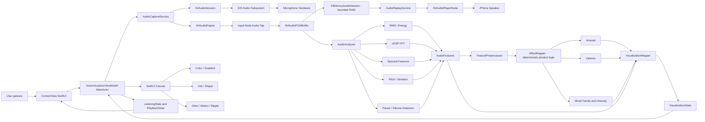

# Audio-to-Emotion Visualizer — Flowcharts & Technology Map

Dokumen ini menjelaskan alur bisnis dan alur antar-object teknologi untuk mengubah karakter suara menjadi mood visual berupa warna, bentuk, glow, dan animasi. Audio mentah hanya ditahan sementara di RAM agar sesi dapat dianalisis dan di-replay secara lokal.

## 1. Flowchart Logic Bisnis



`AudioAnalyzer`, `FeaturePreprocessor`, `AffectMapper`, dan `VisualizationMapper` adalah komponen/fungsi yang dibuat oleh aplikasi. Tidak ada `EmotionMapper` bawaan iOS. `AffectMapper` merupakan ruleset produk berbasis valence/arousal yang dapat diuji dan dikalibrasi.

## 2. Flowchart Object dan Teknologi



## 3. Tanggung Jawab Object

| Object / teknologi | Memproses apa | Mengirim ke mana |
|---|---|---|
| `ContentView` | Input Start/Stop/Replay/Discard dan lifecycle UI | Intent ke `ViewModel` |
| `VoiceVisualizerViewModel` | State aplikasi, error, lifecycle, koordinasi | Perintah ke service dan state ke SwiftUI |
| `AudioCaptureService` | Permission, konfigurasi audio, start/stop engine | `AVAudioPCMBuffer` ke session store dan analyzer |
| `InMemoryAudioSession` | Menahan PCM chunks sementara dengan batas durasi/memori | Buffer ke replay service; dapat di-clear |
| `AudioReplayService` | Menjadwalkan buffer RAM untuk playback lokal | `AVAudioPlayerNode` dan speaker |
| `AVAudioSession` | Permission dan akses audio input/output | Status audio ke service |
| `AVAudioEngine` | Menangkap audio real-time | Buffer audio melalui input tap |
| `AVAudioPCMBuffer` | Sampel PCM sementara di RAM | Session store dan analyzer |
| `AudioAnalyzer` | RMS, silence, FFT, spectral centroid/flux, pitch variation | `AudioFeatures` |
| `Accelerate/vDSP` | Windowing, FFT, magnitude, spectral features | Data spektrum ke analyzer |
| `FeaturePreprocessor` | Normalisasi, clamping, smoothing, dan peak handling | Fitur stabil ke `AffectMapper` |
| `AffectMapper` | Ruleset berbasis valence/arousal; bukan API bawaan atau detector universal | `AffectState` |
| `VisualizationMapper` | Mengubah affect/audio menjadi hue, brightness, scale, glow, motion | `VisualizationState` |
| `SwiftUI Canvas` | Menggambar visual dan animasi | Tampilan akhir di layar |

## 4. Model Data

```swift
struct AudioFeatures: Sendable {
    let energy: Float
    let spectralSharpness: Float
    let spectralFlux: Float
    let pitchVariation: Float
    let pauseRatio: Float
    let speechRhythm: Float
    let isSilent: Bool
}
```

```swift
struct AffectState: Sendable {
    let valence: Float       // negative ... positive
    let arousal: Float       // low energy ... high energy
    let family: EmotionFamily
    let intensity: Float
}
```

```swift
struct VisualizationState: Sendable {
    let hue: Double
    let saturation: Double
    let brightness: Double
    let orbScale: Double
    let glowRadius: Double
    let pulseAmount: Double
    let motionIntensity: Double
}
```

## 5. Kebijakan Audio Sementara dan Replay

```text
Microphone
  → AVAudioSession
  → AVAudioEngine
  → AVAudioPCMBuffer
  ├─→ InMemoryAudioSession (RAM, bounded duration)
  │    → AudioReplayService
  │    → AVAudioPlayerNode
  │    → Speaker
  └─→ AudioAnalyzer
       → AudioFeatures
       → FeaturePreprocessor
       → AffectMapper
       → AffectState
       → VisualizationMapper
       → VisualizationState
       → SwiftUI Canvas
```

Replay harus dipicu eksplisit oleh pengguna. Session buffer memiliki batas durasi atau memory budget; buffer tidak boleh tumbuh tanpa batas. Pengguna dapat menekan Discard untuk menghapus audio dari RAM. Audio tidak ditulis ke file dan tidak dikirim ke server.

`Canvas` hanya bertugas menggambar. Semua logika audio, affect mapping, dan replay berada di luar `View`.
